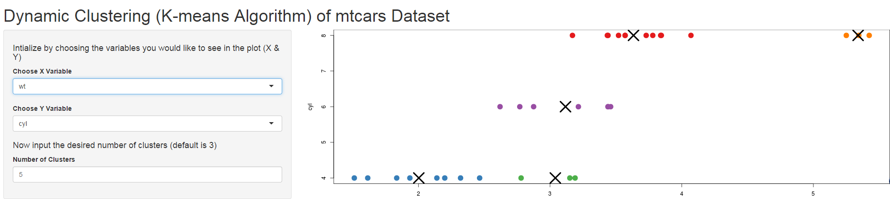

mtcars Data Set Clustering
========================================================
author: Joseph R. Taylor
date: 22 February 2015

The Cluster
========================================================

Using the mtcars data set, we offer clusters based on on any
two main parameters with between 3 and 8 total clusters.


Slide With Code
========================================================


```r
head(mtcars)
```

```
                   mpg cyl disp  hp drat    wt  qsec vs am gear carb
Mazda RX4         21.0   6  160 110 3.90 2.620 16.46  0  1    4    4
Mazda RX4 Wag     21.0   6  160 110 3.90 2.875 17.02  0  1    4    4
Datsun 710        22.8   4  108  93 3.85 2.320 18.61  1  1    4    1
Hornet 4 Drive    21.4   6  258 110 3.08 3.215 19.44  1  0    3    1
Hornet Sportabout 18.7   8  360 175 3.15 3.440 17.02  0  0    3    2
Valiant           18.1   6  225 105 2.76 3.460 20.22  1  0    3    1
```

Our Shiny Server code looks like this:
========================================================
```
library(shiny)
data(mtcars)


shinyServer(function(input, output, session) {
        
        
        selectedData <- reactive({
                mtcars[, c(input$xcol, input$ycol)]
        })
        
        clusters <- reactive({
                kmeans(selectedData(), input$clusters)
        })
        
        output$plot1 <- renderPlot({
                par(mar = c(5.1, 4.1, 0, 1))
                plot(selectedData(),
                     col = clusters()$cluster,
                     pch = 20, cex = 3)
                points(clusters()$centers, pch = 4, cex = 4, lwd = 4)
        })
        
})
```
Our Shiny UI code looks like this:
========================================================
```
library(shiny)
data(mtcars)

shinyUI(pageWithSidebar(
        headerPanel('Dynamic Clustering (K-means Algorithm) of mtcars Dataset'),
        sidebarPanel(
                h4("Intialize by choosing the variables you would 
                        like to see in the plot (X & Y)"),
                selectInput('xcol', 'Choose X Variable', names(mtcars)),
                selectInput('ycol', 'Choose Y Variable', names(mtcars),
                            selected=names(mtcars)[[2]]),
                h4("Now input the desired number of clusters (default is
                   3)"),
                numericInput('clusters', 'Number of Clusters', 3,
                             min = 1, max = 9)
        ),
        mainPanel(
                plotOutput('plot1')
        )
))
```
And the deployed app looks like this:
========================================================

